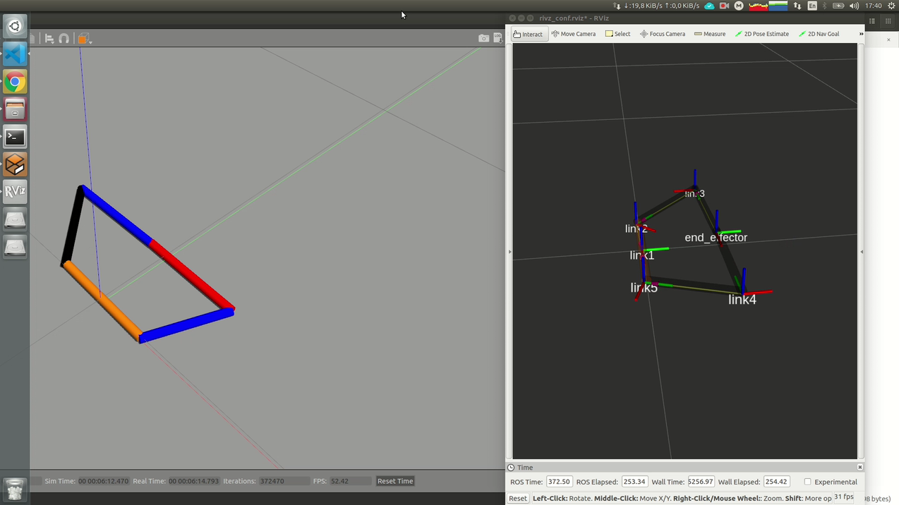

# 5R Policy Gradient Actor-Critic Method
## To run the project, Please follow the steps below.
 
To open the gazebo, run the following command. 
```
roslaunch fiver_gazebo main.launch
```
Then to enable the controller, run the following command.
```
roslaunch fiver_control fiver_control.launch
```
To activate TF in ROS which calculates the end-effector coordinate frame, Please run the following command,
```
rosrun fiver_control fiver_TF.py
```
The following command moves the joints (theta2 and theta5) which are the independent joints in the mechanism.
```
rosrun fiver_control joint_controller.py 
```

After running all the commands above, the gazebo and rviz windows pop out and you will see the following windows,



To able to run the actor-critic algorihm,please run the [a2c_agent](fiver\fiver_control\src\a2c_agent.py) after you run the all above command.


<iframe width="420" height="315"
	src="http://www.youtube.com/watch?v=IUO6pvEAiAo">
</iframe>


First of all, I constructed a 5R mechanism as an example in the ROS environment shown in Fig. 2


I am using continuous action and observation space. Moreover, I built the Deep Policy Gradient with Actor-Critic Methods. I am expecting that agent will learn a specific trajectory in the Gazebo environment without using any forward/inverse kinematic. This project can be extended into any mechanism especially for the mechanisms which do not have any inverse kinematics or have stochastic behavior. If the agent learns in the Gazebo environment, learned parameters can be transferred for the real-life implementations.
For almost 2 days algorithm running and until now I got the following results.
